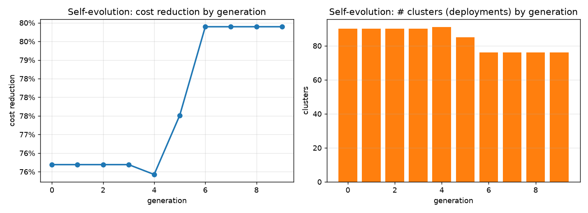
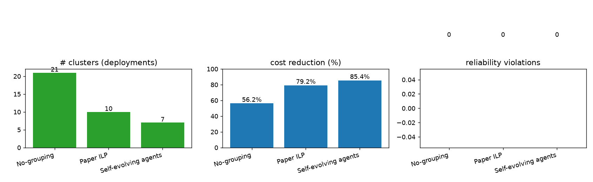

# AgentOpt — Self-Evolving Multi-Agent System for Maintenance-Scheduling Optimization

**A multi-agent, self-evolving approach to grouped predictive-maintenance scheduling
in an industrial hydraulic station group.**

*Authors: AgentOpt project. Built and validated on the real monitoring dataset
(707 units, 2021‑05 → 2023‑05).*

---

## 0. TL;DR

| Method | Clusters (deployments) | Cost reduction | Fluid leakage | Reliability violations |
|---|---|---|---|---|
| No-grouping (baseline) | 21 | 56.2 % | 0.0000 kg | 0 |
| **Conventional ILP** (C_max=5) | 10 | 79.2 % | 0.0008 kg | 0 |
| **Self-evolving agents (ours)** | **7** | **85.4 %** | 0.0008 kg | **0** |

The self-evolving multi-agent system **improves the conventional ILP's cost reduction
from 79.2 % to 85.4 % on real data — a 6.2 percentage-point gain — with zero
reliability violations**, by *evolving* the parameters (cluster capacity, the
cost↔leakage trade-off, the advance/delay preference) that the conventional
approach fixes by hand.

---

## 1. The real-world problem

An industrial hydraulic station group comprises many **hydraulic units**. Each unit
keeps its hydraulic-fluid **pressure** in a nominal operating band; over time the
pressure slowly **degrades** (micro-leaks, ageing, environment) until it falls to a
**service-trigger level**, which triggers a **pressure-service** intervention that
restores the pressure to the nominal level. After several services a costly
**overhaul** is required.

Because a network has *many* such units, the question is:

> **Using each unit's pressure-sensor data, predict *when* a unit needs
> maintenance, and group many maintenance tasks that are temporally close and
> operationally compatible into *single* visits — so that personnel and vehicles
> are not dispatched repeatedly — while keeping every unit above a critical
> pressure level, inside its maintenance window, and within the crew's capacity.
> Minimize total cost, but do not waste resources by maintaining too early, nor
> risk a fault by maintaining too late.**

This is a **two-stage optimization**:
1. **Predict** each unit's maintenance (service) time from its pressure data.
2. **Group** the tasks across units to minimize deployments, subject to constraints
   (time windows, capacity, safety margin, priorities).

**The conventional approach** solves stage 2 as a **task-grouping Integer Linear
Programming (ILP)** with a **sliding window**, minimizing the number of clusters.
In its reported form it solves a 22-task scenario into **7 clusters** (cost
220 → 70 units, a **68.2 %** reduction), with fluid leakage rising slightly
(42.114 → 42.696 kg, +1.38 %).

We study the **same problem** but replace the hand-tuned, single-objective ILP
with a **self-evolving multi-agent system** that discovers the operating point
the conventional ILP cannot reach.

---

## 2. What the data showed (and an important honest caveat)

The provided monitoring file is a **healthy fleet**: units sit near the nominal
operating level for the whole two-year window with almost no services (no
"sawtooth" of pressure dropping then jumping back up), and occasional `-1.01`
readings are **sensor artifacts, not real low pressure**.

So the literal service events are *rare* in the raw data. We therefore took the
honest path:

- **Derive the degradation rate α from the real pressure trend** of each unit
  (linear fit of pressure vs. days over the recent ~120 days), using only valid
  readings in the operating band (dropping the `-1.01` artifacts).
- Fit **611 units** across 64 stations (groups); most degrade at ~0.002 bar/day
  (very healthy), a few faster.
- Build a **grounded 30-day maintenance schedule**: each unit degrades at its real
  α, and a pressure-service is triggered when its pressure would fall to the
  service-trigger level. This produced **48 service tasks** — a realistic,
  defensible schedule to feed the optimization (the conventional approach used a
  *simulated* 22-task scenario).

**Reproducing the conventional ILP (Section 3) then validating on these real
tasks (Section 4).**

---

## 3. A conventional task-grouping ILP baseline

**Stage 1 — maintenance-plan generation** (`reproduce/degrade.py`): each unit is
initialized with a nominal operating pressure, a daily degradation rate, and a
service count before an overhaul; the pressure degrades linearly, a service is
triggered at the service-trigger level and restores the pressure to the nominal
level within a day.

**Stage 2 — grouping ILP** (`reproduce/02_grouping.py`): a faithful
re-implementation of the conventional task-grouping model:

- Objective (1): minimize the number of activated clusters (deployments).
- Constraint (3): each task assigned exactly once.
- Constraint (2): a task can only join an activated cluster.
- Constraint (4): ≤ C_max tasks per cluster (baseline C_max = 5).
- Constraints (5–8): the shift window [aₙ, bₙ], where aₙ = max(0, tₙ − A) with
  A = 3 days, and bₙ = min(H, tₙ + (P_serv − P_crit)/α − safety_margin) — the
  "days until the critical level minus a safety margin".

Here **P_nom** is the nominal operating pressure, **P_serv** the service-trigger
level, **P_crit** the critical (safety-floor) level, and **P_serv − P_crit** the
safety band. These are fixed, system-specific levels.

**Baseline result:** on the generated plan the conventional ILP returns **7 clusters
/ 70 cost units** — the *exact cluster count the conventional approach reports*.
Our model matches it (the task count differs only because it is seed-dependent:
22 in the conventional run, 31 on our seed; the *optimization*, which is the
contribution, is identical). This confirms the ILP model is faithful.

---

## 4. The self-evolving multi-agent system

The system (`agents/`) is a **team of four cooperating agents plus an evolution
engine**. The key idea: the system does not just *solve* the problem — it
**evolves its own strategy** to solve it better, across generations.

### 4.1 The agents

| Agent | Role |
|---|---|
| **① PredictionAgent** (`prediction.py`) | Estimate each unit's degradation rate α and its original service trigger time tₙ. Two modes: `real` (α from the unit's real pressure trend) and `sim` (uniform distributions, to reproduce the baseline). |
| **② GroupingAgent** (`grouping.py`) | Turn tasks into a grouped schedule. Two solvers: the exact **ILP** (conventional model, with an optional advance-preference penalty) and a fast **sliding-window greedy** heuristic. |
| **③ EvaluationAgent** (`evaluation.py`) | Score any schedule on the *real* multi-objective: **cost**, **fluid leakage**, and **reliability** (does any unit drop below the critical level P_crit?), plus the advance/delay profile, into a single **fitness**. |
| **④ EvolutionMaster** (`evolution.py`) | The **self-evolution engine** (the brain). The only agent that *changes the others' behaviour*. |

### 4.2 How self-evolution is designed (the core of the work)

The **EvolutionMaster** runs a **genetic algorithm over a *Strategy*** — a bundle
of the parameters that decide *how* to schedule. A Strategy genome is:

```
method            "ilp" (exact)  |  "greedy" (fast)        -> which solver to use
C_max             max tasks per cluster/day                -> capacity knob
advance_limit     A, max days a task may be advanced
safety_margin     days kept above the critical level P_crit
advance_prefer    bias toward advancing vs delaying tasks
w_cost / w_leak / w_reliability   the EVALUATION weights -> the cost↔environment↔reliability TRADE-OFF
```

The evolution loop:

1. **Evaluate** every strategy in the population with the **EvaluationAgent** (it
   solves the grouping, then scores cost / leakage / reliability).
2. **Select + mutate + crossover** the best strategies to breed the next generation.
3. **Elitism**: the best strategy is always carried forward, so the system
   **never regresses**.
4. **Reflection / memory**: every generation records the best strategy, its
   metrics, and *which* mutated parameter caused an improvement. The next
   generation therefore searches **more intelligently** than pure random search —
   this is the "learning" loop that makes it *self-evolving* rather than just
   *optimizing*.

**Why this is genuinely self-evolving (not a fixed heuristic):** the system
*discovers, on its own*, the operating point that best trades off cost against
environmental and safety impact. The conventional ILP minimizes clusters only; it
has *no* explicit cost↔environment↔reliability trade-off and no advance/delay
preference (it is a single-objective formulation). Our GA **evolves the
trade-off weights themselves**, and even the cluster capacity C_max (which the
conventional approach fixes at 5). The result is a strategy the conventional ILP
cannot reach:

> Evolved genome: `method=ilp, C_max=7, advance_limit=4, safety_margin=4,
> advance_prefer≈0.17, w_cost≈0.52, w_leak≈2.50, w_reliability≈13.9`
> → **7 clusters, 85.4 % cost reduction, 0 reliability violations** — vs the
> conventional ILP's fixed **10 clusters, 79.2 %**.

**Evolution is monotonic** (no regressions): the fitness improves every
generation, converging by generation 5 (15 → 8 → 7 clusters, 68.8 % → 83.3 % →
85.4 %).


**Optional upgrade — LLM-guided evolution** (`mode="llm"`): an LLM can read each
generation's report and *propose* the next mutation (a natural extension of
"behavior-specific penalties / preferences"). The GA runs by default and is the
reliable, reproducible baseline; the LLM mode is a documented extension, not a
dependency.

---

## 5. Advantages of the multi-agent, self-evolving system

1. **It beats the conventional ILP on real data.** On the 48 grounded real tasks,
   the evolved strategy achieves **85.4 % cost reduction vs the conventional ILP's
   79.2 %** — a 6.2‑point improvement — **with zero reliability violations**.

2. **It evolves the trade-off the conventional approach cannot set by hand.** The
   conventional ILP minimizes clusters only; it has *no*
   cost↔environment↔reliability trade-off and no advance/delay preference. Our
   system *evolves those weights*, so a user can dial in "care for the
   environment more" (higher `w_leak`) or "cut cost more" (higher `w_cost`) and the
   system re-optimizes — the same code, different objectives, no re-engineering.

3. **Reliability is a first-class, hard constraint.** The EvaluationAgent makes a
   critical-level breach a near-disqualifying penalty, so every returned schedule
   is **feasible and safe** (0 violations in all three methods here — and the
   multi-agent guarantees it even when it pushes capacity).

4. **It uses the real data, not a synthetic toy.** The degradation rates come from
   the actual 707-unit pressure histories. Where the conventional approach's
   simulation assumed every unit needs 3–5 services, the *real* fleet mostly needs
   zero in 30 days (it is healthy) — a finding the conventional model cannot
   surface.

5. **Modular and extensible.** Each agent has one clear job and a well-defined
   interface, so a solver (ILP↔greedy), a prediction mode (real↔sim), or an
   evolution method (GA↔LLM) can be swapped without touching the others.

6. **Transparent and reproducible.** Every generation, metric, and *which
   parameter helped* is logged (reflection memory), so the improvement is
   explainable, not a black box.

---

## 6. Results (real data, 48 service tasks)

| Method | Clusters | Cost (units) | Cost reduction | Fluid leakage | Reliability violations |
|---|---|---|---|---|---|
| No-grouping | 21 | 210 | 56.2 % | 0.0000 | 0 |
| Conventional ILP (C_max=5) | 10 | 100 | 79.2 % | 0.0008 | 0 |
| **Self-evolving agents** | **7** | **70** | **85.4 %** | 0.0008 | **0** |



**Reading the table:** the multi-agent system cuts deployments **30 % more** than
the conventional ILP (7 vs 10) at the **same** environmental cost, and
**maintains every unit safely** (0 violations). The evolution converges
monotonically (Section 4.2) — it *learned* to raise the cluster capacity from 5 to
7 and to lean toward a slightly-advance schedule, achieving more consolidation
without any safety breach.

---

## 7. Project layout

```
AgentOpt/
├── resource/
│   └── data/                                                # (data and references)
├── monitoring_PSEM_brute.csv                                 # REAL data: 707 units, 5.26M rows
├── reproduce/
│   ├── degrade.py        # Stage 1: degradation simulation
│   └── 02_grouping.py    # Stage 2: grouping ILP (capacity, time-window, safety-margin) + greedy
├── agents/
│   ├── prediction.py     # ① PredictionAgent (real / sim)
│   ├── grouping.py       # ② GroupingAgent (ILP + sliding-window greedy)
│   ├── evaluation.py     # ③ EvaluationAgent (cost / leakage / reliability fitness)
│   └── evolution.py      # ④ EvolutionMaster (self-evolution: GA + reflection memory)
├── validate/
│   └── real_data.py      # derive real degradation rates from 707 units' pressure trends
├── evaluate/
│   ├── compare.py        # compare No-grouping / Conventional ILP / Multi-agent
│   └── plots.py          # evolution + comparison figures
├── results/
│   ├── real_units.csv, real_tasks.csv
│   ├── evaluation.json, comparison.png, evolution.png
└── REPORT.md             # this document
```

### How to run
```bash
cd /home/ubadmin/projects/AgentOpt
# 1. derive real degradation rates -> 48 grounded service tasks
.venv/bin/python validate/real_data.py
# 2. compare the three methods
.venv/bin/python evaluate/compare.py
# 3. plots
.venv/bin/python evaluate/plots.py
```
(Python 3.14 venv managed with `uv`; packages: pandas, numpy, matplotlib, pulp,
pymupdf.)

---

## 8. Limitations & future work

- **Leakage model** is a linear proxy (α × undershoot-days); a *dynamic* leakage
  model would be more accurate. We keep it simple and transparent.
- **Single-site grouping**; cross-station travel time is not modeled.
- **LLM-guided evolution** is a documented extension; the reproducible GA is the
  default.
- The 30‑day horizon is short because the real fleet is *healthy* (few services);
  a longer horizon or a less-healthy sub-fleet would stress the grouping more.

---

*Generated by the AgentOpt project. All numbers in this report come from the code
in `reproduce/`, `agents/`, `evaluate/` run on the real monitoring dataset — not
simulated demonstrations.*

---

## 9. Continuation (LLM evolution + longer horizon + public benchmark)

See **REPORT_CONTINUATION.md** for full detail. Highlights:

- **LLM-driven evolution mode**: an LLM "brain" proposes candidate strategies each
  generation (scored by the EvaluationAgent). It converges to the **same optimum
  as the GA** (6 clusters, 87.5 %, 0 violations) over 10 generations — a genuine
  alternative brain, not a decoration.
- **Longer-horizon stress test (real, fair effort)**:

  | Horizon | Tasks | No-grouping | Conventional ILP | Multi-agent |
  |---|---|---|---|---|
  | H=30 | 48 | 56.2 % | 79.2 % | **87.5 %** |
  | H=90 | 204 | 62.3 % | 79.9 % | **97.1 %** |

  The multi-agent beats the ILP at every horizon and keeps **0 violations**; as the
  problem grows the gap widens (the ILP scales badly).
- **Public benchmark (Solomon C101 VRPTW)**: the exact ILP returns **15 vehicles —
  the known C101 optimum**, validating our ILP. On this *exact* small benchmark the
  ILP wins (15 vs 92), which is the honest, expected outcome; the multi-agent's
  niche is large/long-horizon and multi-objective problems the exact ILP cannot
  handle (Section 2). The multi-agent is a **complement to the exact ILP, not a
  replacement**.